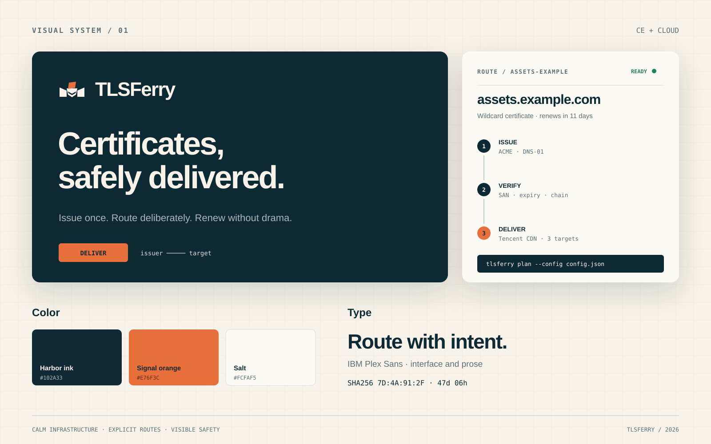

# TLSFerry 品牌与 UI 识别规范

TLSFerry 的识别核心不是“安全软件常见的盾牌或锁”，而是一次可观察、可验证的交付：证书从签发端出发，经过明确的航线，抵达一个或多个基础设施目标。



## 品牌定位

- **角色**：沉着的基础设施操作员，不是热闹的增长型 SaaS。
- **核心承诺**：Certificates, safely delivered.
- **表达原则**：先说对象、动作和边界，再说能力；避免“智能、安全、无缝”一类没有证据的形容词。
- **CE / Cloud 关系**：两者共用品牌语言和协议视觉；CE 保持本地、开源、操作可见，Cloud 使用相同识别但必须明确标注托管边界。Cloud 控制台实现仍属于私有仓库。

## Logo

标志由三部分构成：左右两个基础设施端点、中间的渡船、上方的证书。船体中的留白形成航迹，也让符号在小尺寸下仍有方向感。

正式资产：

- [`tlsferry-logo.svg`](../assets/brand/tlsferry-logo.svg)：横向主 Logo，适用于 README、文档页头和发布页。
- [`tlsferry-mark.svg`](../assets/brand/tlsferry-mark.svg)：双色图形标，适用于头像、应用图标和 favicon。
- [`tlsferry-mark-mono.svg`](../assets/brand/tlsferry-mark-mono.svg)：单色图形标，适用于终端文档、水印、印刷和受限色彩环境。

使用规则：

- 主标志四周至少保留一个“证书块高度”的净空。
- 图形标数字界面最小使用尺寸为 20px；16px 以下使用单色版。
- 不旋转、不加外发光、不改成渐变，不把橙色扩展到船体或背景大面积区域。
- 深色背景上船体和端点改用盐白 `#FCFAF5`，证书保持信号橙。
- Logo 不与盾牌、锁、云朵等第二图标组合。

## 色彩

| Token | 色值 | 用途 |
| --- | --- | --- |
| `harbor-950` | `#102A33` | 主文字、深色背景、主要按钮 |
| `harbor-700` | `#31505A` | 次级文字、图标 |
| `harbor-500` | `#5D6E73` | 辅助信息、字段说明 |
| `harbor-200` | `#BFCBCD` | 分隔线、禁用边界 |
| `harbor-100` | `#D7DEE0` | 浅色描边、表格线 |
| `salt-50` | `#FCFAF5` | 主界面背景 |
| `salt-100` | `#F7F3EA` | 页面底色、分区背景 |
| `signal-500` | `#E76F3C` | 主执行动作、当前步骤、需要注意的状态 |
| `success-600` | `#2F7A64` | 已通过、健康、完成 |
| `danger-600` | `#A94336` | 拒绝、失败、破坏性动作 |

信号橙每个视图只承担一个焦点。它不是装饰色：当页面没有主执行动作、当前步骤或注意状态时，就不应出现大面积橙色。

建议的 CSS tokens：

```css
:root {
  --tf-harbor-950: #102a33;
  --tf-harbor-700: #31505a;
  --tf-harbor-500: #5d6e73;
  --tf-harbor-200: #bfcbcd;
  --tf-harbor-100: #d7dee0;
  --tf-salt-50: #fcfaf5;
  --tf-salt-100: #f7f3ea;
  --tf-signal-500: #e76f3c;
  --tf-success-600: #2f7a64;
  --tf-danger-600: #a94336;
}
```

## 字体与数据

- 界面、正文和标题使用 **IBM Plex Sans**；它具有工程感，但不会像默认系统字体那样缺少识别。
- 命令、域名、证书指纹、时间和数值使用 **IBM Plex Mono**，并开启等宽数字。
- 大标题字重 700，行高约 1.05；界面标题 600；正文 400；小标签 600 并增加约 `0.08em` 字距。
- 正文单行控制在约 65 个英文字符。证书指纹不截断语义段，允许按冒号或固定字节组换行。

字体未随仓库打包。实现界面时使用开源字体包，并保留以下回退：

```css
font-family: "IBM Plex Sans", "Avenir Next", system-ui, sans-serif;
font-family: "IBM Plex Mono", "SFMono-Regular", Consolas, monospace;
```

## UI 结构

TLSFerry 的界面先展示“航线”，再展示资源列表。一个证书任务的标准阅读顺序是：

1. **对象**：域名、证书名和所属环境。
2. **路线**：签发方 → 校验方式 → 部署目标。
3. **状态**：当前步骤、最近一次验证、距离续期的时间。
4. **动作**：预览、验证、签发、交付或回滚。
5. **证据**：指纹、provider reference、日志和时间戳。

桌面控制台优先使用顶部产品导航和任务上下文栏。不要把所有功能永久塞入宽侧栏；证书详情页应把航线作为主视觉，并在右侧或下方按需展开证据。列表页允许高密度表格，操作页必须给确认信息留足空间。

### 组件语言

- 页面最大内容宽度为 `1280px`，浅色界面使用盐白背景。
- 外层操作面板圆角 `10px`，按钮与输入框 `6px`，不要让每个元素都变成胶囊。
- 默认边界用 `harbor-100`；阴影只用于浮层和需要表达层级的面板。
- 主按钮使用深港蓝；只有立即执行交付、确认外部变更等当前关键动作使用信号橙。
- Hover 只改变背景或上移 1px；Pressed 下压 1px；Focus ring 使用 2px 信号橙并保留 2px 间距。
- 状态不要只靠颜色。必须同时出现文字：`Ready`、`Pending`、`Action required`、`Refused`、`Failed`。
- 空状态要给出下一条可执行命令或配置入口，而不是只显示“暂无数据”。

## CLI 识别

CLI 是 CE 的主界面，应保持脚本友好：

- 默认 stdout 不输出 ANSI 色彩、大型 ASCII Logo、emoji 或动态 spinner。
- 标题使用 `TLSFerry <object/action>`；下一层用两个空格缩进的键值对。
- 状态词先于解释：`READY`、`PENDING`、`REFUSED`、`FAILED`。错误信息直接说明拒绝原因和下一步。
- 机器输出继续由 `--format json` 提供；视觉格式调整不得改变 JSON 字段。
- 预览与执行必须视觉分离。预览结尾明确 `No external operations performed.`；执行命令继续要求显式确认参数。

推荐终端结构：

```text
TLSFerry delivery plan

assets.example.com
  route     Let's Encrypt staging → Tencent CDN
  renews    in 11 days
  status    READY

Next: tlsferry deploy ... --execute
```

## 文案

优先使用具体动词：`Validate`、`Issue`、`Verify`、`Deliver`、`Renew`、`Restore`。其中 `Deliver` 是品牌动作，面向用户的导航和概览优先于 `Deploy`；CLI 命令继续保留 `deploy`，避免破坏兼容性。

不要写：

- “Seamless multi-cloud certificate management”
- “Military-grade security”
- “One-click automation”

改写为：

- “Issue once. Deliver to the targets you choose.”
- “Credentials stay in your operating-system credential manager.”
- “Preview the route before any cloud change.”

## 发布物

- GitHub README 和 Release 页面使用横向 Logo。
- 社交分享图使用盐白背景、左侧一句具体承诺、右侧航线或证书状态，不使用抽象渐变。
- 二进制和压缩包文件名保持小写 `tlsferry`，品牌展示名保持 `TLSFerry`。
- CE 页面必须明确 `Community Edition`；Cloud 页面必须明确 `Cloud`，不能只靠不同颜色区分版本。
